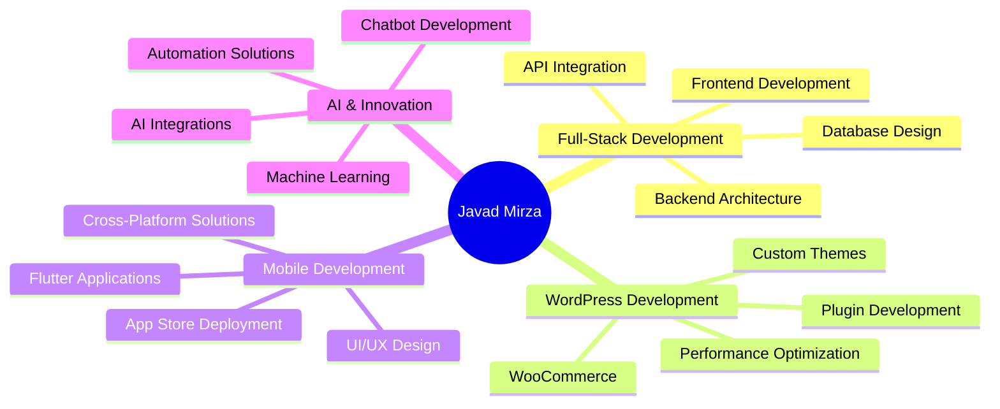

# 🌟 Javad Mirza

### 🚀 Full-Stack Developer × 🎨 WordPress Specialist × 📱 Mobile App Creator

*Building innovative web solutions and digital experiences*

---

## 🛠️ Tech Arsenal

### 👨‍💻 Programming Languages

### 🧩 Frameworks & Libraries

### 🗄️ Databases & CMS

### 🎨 Design & Creative Tools

---

## 📊 GitHub Analytics

<table>
<tr>
<td width="50%">

</td>
<td width="50%">

</td>
</tr>
</table>

### 🏆 GitHub Trophies

---

## 🌟 Professional Focus Areas

---

## 🎯 Current Focus

| 🔥 **Currently Working On** | 🎓 **Learning** | 🎯 **Goals 2025** |
|:---|:---|:---|
| AI-powered web applications | Advanced React patterns | Launch 5 major projects |
| Custom WordPress solutions | Next.js 15 features | Open source contributions |
| Flutter mobile apps | AI/ML integrations | Tech conference speaking |

---

## 🚀 Featured Projects

| Project | Description | Tech Stack |
|:---|:---|:---|
| 🛒 **Mirza Kala Theme** | Custom WooCommerce theme with Persian Jalali date picker |   |
| 🤖 **AI Chatbot Solution** | Domain-specific AI chat application |   |
| 🚚 **Delivery App Platform** | Courier management system |   |
| 💰 **Crypto Exchange Site** | Modern trading platform interface |   |

---

## 📈 Contribution Activity

---

## 🤝 Connect & Collaborate

### 💌 Let's Build Something Amazing Together!

*"Code is like humor. When you have to explain it, it's bad."*

**📧 Email:** [contact@javadmirza.dev](mailto:contact@javadmirza.dev)  
**🌍 Location:** Available for remote collaboration worldwide  
**💼 Status:** Open for freelance projects & collaborations

---

  

